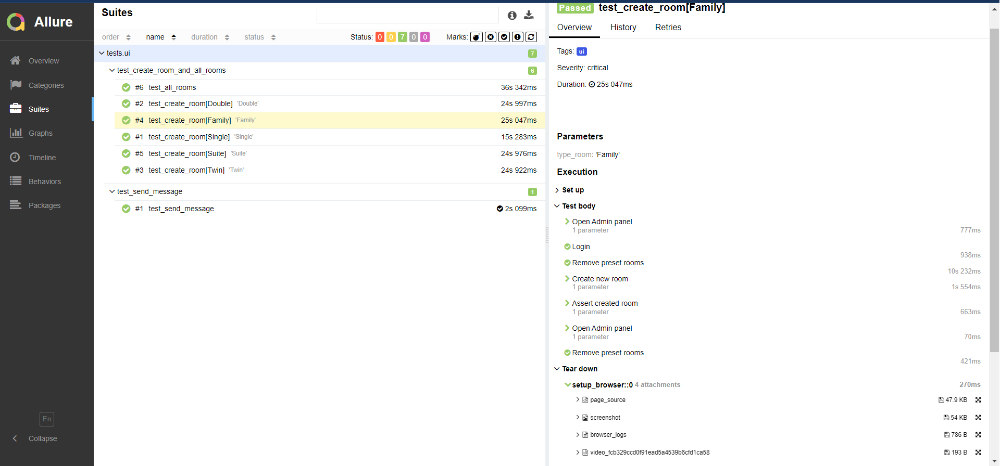
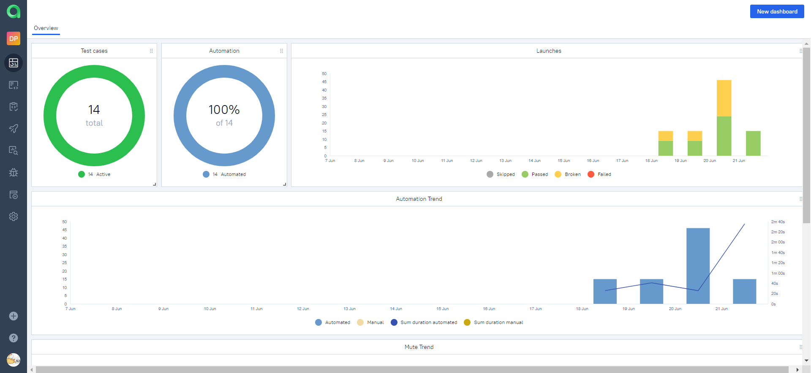

## Описание

<p>В проекте реализована UI автоматизации тестирования на Python.
<p>При написании тестов применялись инструменты ООП.
<p>В тестах шаги размечены с помощью allure.step.
<p>Браузер в UI-тестах запускается удаленно в Selenoid.

# Проект автоматического тестирования сервиса бронирования гостиничных номеров Restful Booker Platform"

#### Created by Mark Winteringham / Richard Bradshaw

> <a target="_blank" href="https://automationintesting.online/">Restful Booker
> Platform</a>

## Проверяется функционал сервиса:

#### UI  автотесты

- [x] Отправка пользователем сообщения на главной странице сервиса.
- [x] Создание админом всех видов гостинничных номеров, отображение на главной
  странице.
- [x] Создание админом гостинничного номера, отображение на главной странице.

## Особенности тестов

Тест test_create_room параметризован, создается каждый вид гостиничного номера.

## Используемые технологии

Python, Pytest, Selen, Selenoid, Allure Report, Allure TestOps, GitHub.
<p>
  <code></code>
  <code></code>
  <code></code>
  <code></code>
  <code></code>
  <code></code>
</p>


## Локальный запуск автотестов

Запуск ui тестов:

```bash
pytest tests/ui
```

Получение отчёта:

```bash
allure serve allure-results
```


## Отчет прохождения UI тестов




## Dashboard_Allure_TestOps



